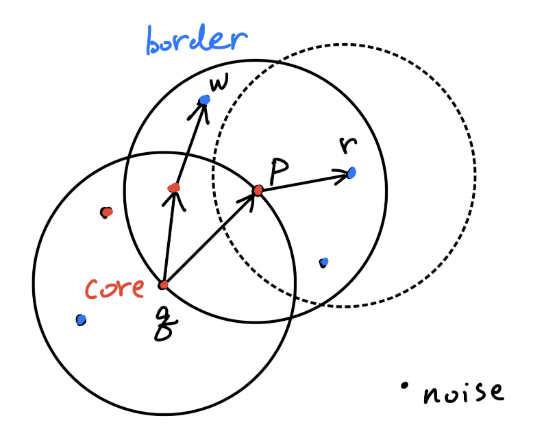
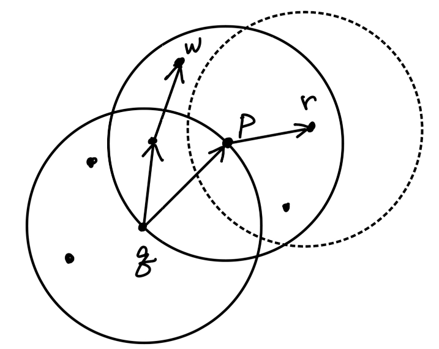

## Hierarchical-based Clustering

Hierarchical-based clustering 是一种将数据对象分组为层次结构（hierarchy）的聚类方法。它提供了一种嵌套的簇结构，非常适合数据的总结和可视化。

### 特点
- **无需预先指定簇的数量**：与 K-means 等方法不同。
- **提供数据结构的更多洞察**：揭示对象之间的关系。
- **Flexible linkage criteria**：可以根据数据特性选择不同的链接方式。
- linkage 决定了 **Distance Between Clusters**
  - **Single linkage**: 使用两个簇中最近点之间的距离，适合发现链式结构的簇。
  - **Complete linkage**: 使用两个簇中最远点之间的距离，适合发现紧密的球状簇。
  - **Average linkage**: 使用簇中所有点之间的平均距离，平衡了单链和全链的特点。
  - **Centroid linkage**: 使用簇中心之间的距离，适合均匀分布的数据。
  - **Ward’s method**: 最小化簇内平方误差，适合发现紧密且均匀的簇。

**总结**：链接准则的选择取决于数据的分布特性和应用场景。

##### 示例
- 在进化研究中，根据生物特征对动物进行分组，揭示进化路径。
- 在企业中，按层次结构对员工分组，例如：{Executives, Managers, Staff}。

### 两种方法
1. **Agglomerative (bottom-up)**：从每个对象作为单独的簇开始，逐步合并最近的簇，直到形成一个簇或满足终止条件。
   - **AGNES (AGglomerative NESting)**:
     - **Step 1: Initialization**: 每个数据点作为一个独立的簇（n 个簇）。
     - **Step 2: Find nearest clusters**: 根据预定义的相似度或距离度量，找到最近的两个簇。
     - **Step 3: Merge clusters**: 合并最近的两个簇为一个新的簇。
     - **Step 4: Update distance matrix**: 更新距离矩阵以反映新簇与其他簇之间的距离。
     - **Step 5: Repeat**: 重复步骤 2-4，直到所有数据点合并为一个簇（形成树的根）或满足终止条件。
     - **Output**: 生成一个层次结构（树状图或 dendrogram），表示簇的嵌套关系。

2. **Divisive (top-down)**：从所有对象作为一个簇开始，逐步将簇分裂为更小的子簇，直到每个簇足够相似或只包含一个对象。

### Dendrogram

Dendrogram 是一种树状图，用于可视化层次聚类的过程和结果。它表示了数据点如何逐步合并或分裂成簇的层次结构。

#### 特点
- **层次结构**：显示了簇的嵌套关系，从单个数据点到最终的整体簇。
- **分裂或合并的距离**：每次合并或分裂的距离可以通过**树的高度**表示。
- **直观性**：帮助用户理解数据的聚类结构和相似性。

#### 用途
1. **确定簇的数量**：通过观察树的分裂点，选择合适的层次来定义簇的数量。
2. **分析数据结构**：揭示数据点之间的相似性和嵌套关系。
3. **可视化聚类过程**：展示从单个点到整体簇的合并过程。

**总结**：Dendrogram 是层次聚类的重要工具，提供了直观的方式来探索和解释数据的聚类结构。

**总结**：Hierarchical-based clustering 提供了一种灵活且直观的方式来探索数据的层次结构。

## DBSCAN 算法

DBSCAN（基于密度的噪声应用空间聚类）是一种基于密度的聚类算法，通过将数据点密集的区域识别为簇，并将稀疏区域视为噪声，从而实现聚类。它特别适用于具有任意形状和噪声的数据集。

### 核心概念
- **核心点 (core objects)**：在半径 `ε` 内至少有 `minPts` 个邻居的点。
- **边界点 (border objects)**：𝑝 belongs to a cluster 𝐶, but 𝑝 is not a core object
- **噪声点 (noise)**：既不是核心点，也不在任何核心点的 `ε` 邻域内。
- **`minPts`**：形成一个密集区域所需的最小点数，包括核心点本身。

### Density-based cluster

密度聚类的核心思想是通过密集区域识别簇，并将稀疏区域视为噪声。具体特点包括：
- **Connectivity**: 簇内的任意两个点通过 `density-connected` 连接。
- **Maximality**: 如果一个 core object p 点属于簇 c，那么所有从该点 `density-reachable` 的点也属于该簇。
    - core object 𝑝, 𝑝 ∈ c

### => Density-Connected 定义

两个点 w 和 r 是 `density-connected` 的，需要满足：

1. 存在一个 core object p，使得：p -> w, 且 p->r
   - w 是 `density-reachable` 从 p
   - r 是 `density-reachable` 从 p

#### 特性
- **对称性 symmetric**: `density-connected` 是对称的
  - 如果点 p 与点 r 是 density-connected，那么点 r 与点 p 也是 density-connected
- **非传递性 NOT transitive**: `density-connected` 不具有传递性
  - 如果 p 和 w 是 density-connected，w 和 r 是 density-connected
  - 这并不意味着 p 和 r 一定是 density-connected

### => Density-Reachability 定义

- **directly density-reachable**（直接密度可达）  
  如果点 q 在点 p 的 ε 邻域内，并且 p 是 core object，则称 q 是 `directly density-reachable` 从 p。  
  换句话说，只有当 p 是核心点且 q 距离 p 不超过 ε 时，q 才是从 p 直接密度可达。

- **density-reachable**（密度可达）  
  如果存在一系列点 p₁, p₂, ..., pₙ，使得：
  - p₁ = p，pₙ = q
  - 对于每个 i ∈ [1, n-1]，pᵢ₊₁ 是 `directly density-reachable` 从 pᵢ

  则称 q 是从 p `density-reachable` 的。  
  也就是说，`density-reachable` 是通过一系列直接密度可达的点连接起来的，可以是间接的。

**总结**：  
- `directly density-reachable` 是一步关系，只涉及两个点且前者必须是 core object。  
- `density-reachable` 可以是多步关系，通过一条由 `directly density-reachable` 连接的路径实现。

## 优势
- 不需要预先指定簇的数量。
- 能处理任意形状的簇。
- 对噪声和离群点具有鲁棒性。
## 步骤
1. 对每个点，确定其 `ε` 邻域。
2. 识别核心点 (core objects)，并通过连接密度可达 (density-reachable) 的点形成簇。
3. 将不属于任何簇的点标记为噪声 (noise)。
